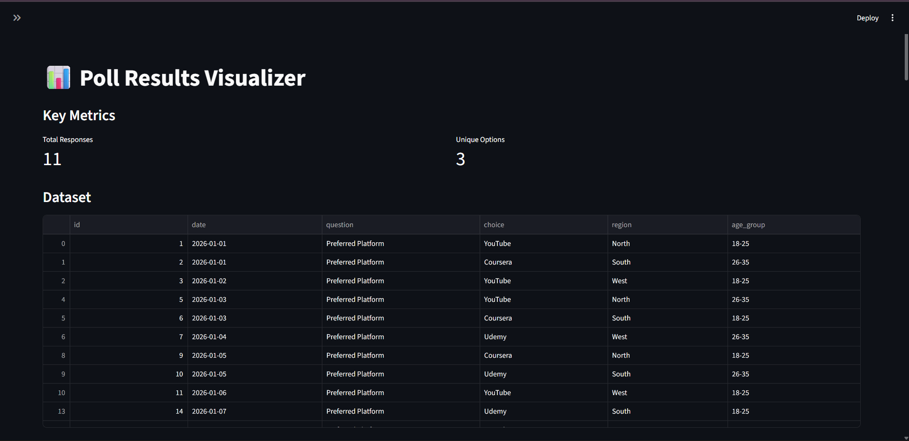
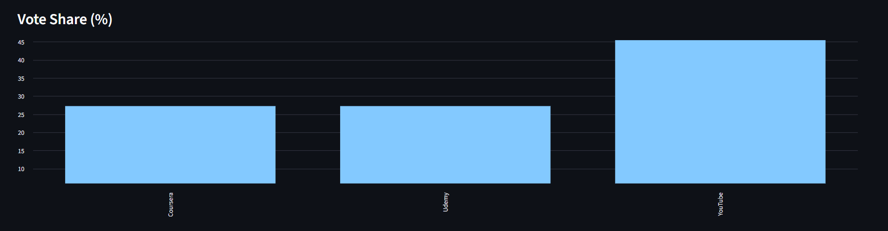
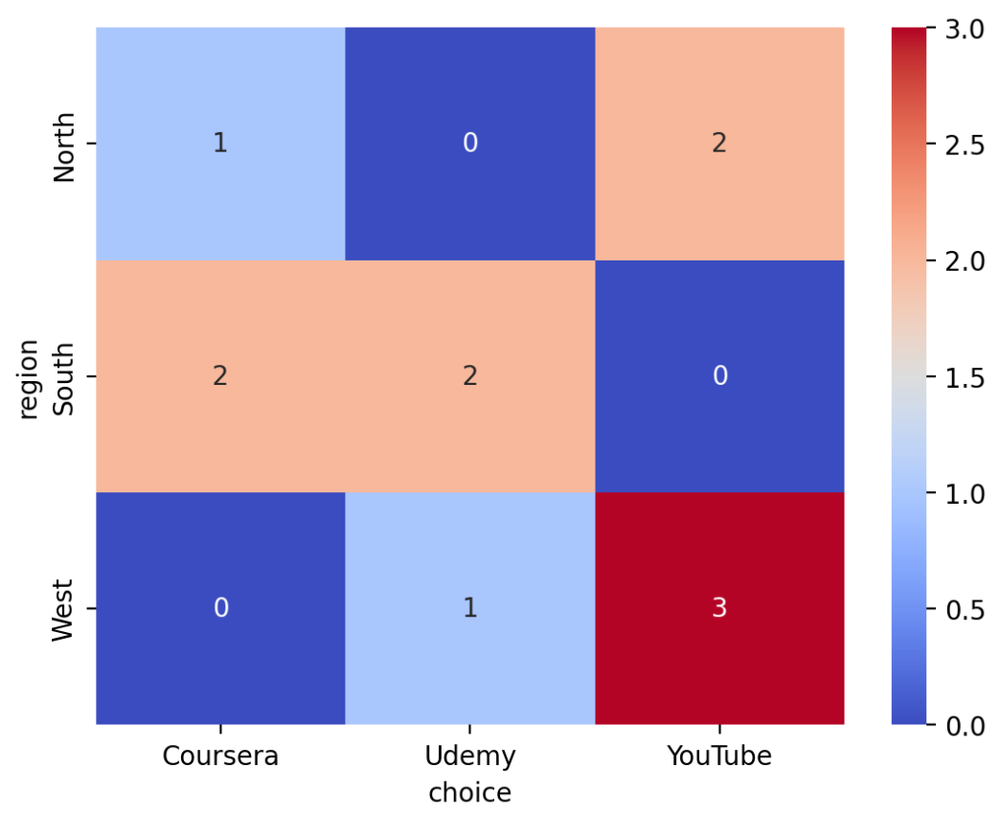
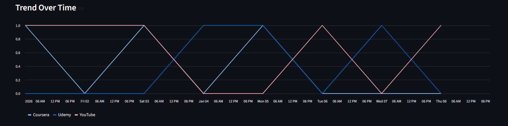
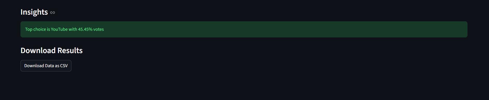

# 📊 Poll Results Visualizer

## 📌 Overview
This project analyzes and visualizes poll/survey data to extract meaningful insights using Python and Streamlit.

## 🚀 Features
- Data cleaning & preprocessing
- Interactive dashboard
- Region & demographic analysis
- Trend analysis over time
- Downloadable filtered dataset
- Insight generation

## 🛠 Tech Stack
- Python
- Pandas
- Matplotlib & Seaborn
- Streamlit

## 📊 Use Case
This project simulates real-world survey analysis used in:
- Market research
- Customer feedback systems
- Educational analytics

## ▶️ Run Locally
```bash
python -m streamlit run app.py

## 📸 Output Preview

### Dashboard


### Charts


### Analysis





## 🎥 Demo Video

[Watch Demo](images/demo.mp4.mp4)